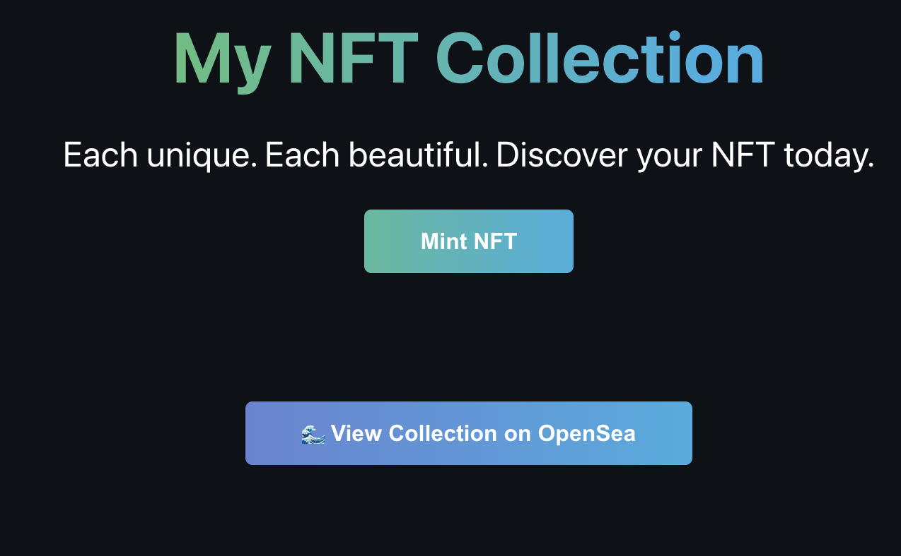

# Mint Your Own NFT Collection Web3 app built using a buildspace guide

## Description
A Web3 Dapp built using My first token deployed to the kovan test network. The token added TTN was assembled using a guide by Dapp University. 

## What was Learned
- How to create a test network wallet and add ETH to the wallet using https://faucets.chain.link/
- How to use connect a solidity smart contract deployed to the Rinkeby testnet too my front end react app
- How Contracts in Solidity are assembled with constructors, mappings, and functions 
- How to mint an NFT and view it under https://testnets.opensea.io/
- How to use https://dashboard.alchemyapi.io/ to create an API key so we can interact with the rinkeby testnet

## Instructions
1. Use https://faucets.chain.link/ and set Network to rinkeby then copy and paste your rinkeby network metamask address into Testnet account address. click send request and it will wait for it too finish and check your metamask for your test ETH
2. make sure you are on the rinkeby testnet in your metamask
2. open the deployed app and click connect wallet and sign through metamask. Then click the Mint NFT button and use the ETH from you got from the faucet pay the gas fee. An alert will appear with a direct address to your testnet NFT on opensea.

## License
This project is licensed under the terms of the [MIT](https://opensource.org/licenses/MIT) license

## Questions
My Github Profile: [cluck135](https://github.com/cluck135)

Email me your questions at: [casenluck@gmail.com](mailto:casenluck@gmail.com)

## Video

